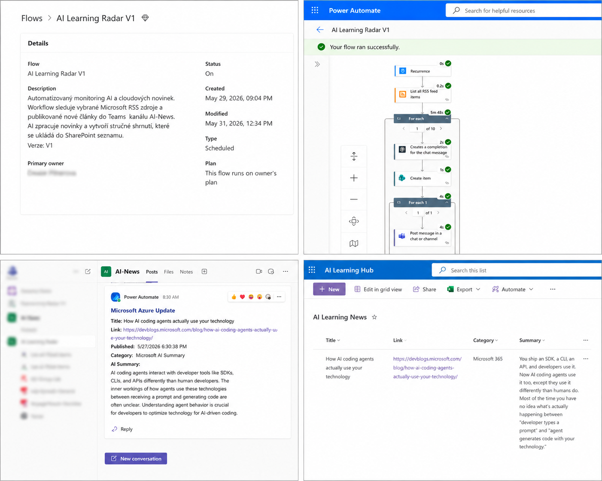

## (CZ) - Automatizovaný monitoring AI a cloudových novinek v Microsoft ekosystému.

**Stav projektu:** Dokončeno
**Typ projektu:** Osobní portfolio projekt
## Moje role

V rámci projektu jsem:

navrhla workflow architekturu
vytvořila Power Automate flow
integrovala Azure OpenAI pro generování souhrnů
nakonfigurovala SharePoint List pro ukládání výsledků
nastavila publikaci novinek do Microsoft Teams
testovala a ověřovala funkčnost celého řešení
vytvořila dokumentaci projektu

Projekt pravidelně sleduje vybrané Microsoft RSS zdroje, automaticky zpracovává nové články pomocí Azure OpenAI, ukládá výsledky do SharePointu a publikuje souhrny do Microsoft Teams.

### Workflow

RSS Feed
↓
Power Automate
↓
Azure OpenAI
↓
SharePoint Online
↓
Microsoft Teams

### Hlavní funkce

* Automatické sledování Microsoft AI a cloudových novinek
* Načítání článků z RSS zdrojů
* AI generované souhrny pomocí Azure OpenAI
* Ukládání článků a souhrnů do SharePoint Listu
* Publikace novinek do Microsoft Teams kanálu
* Pravidelné plánované spouštění
* Centralizované úložiště znalostí a novinek

### Použité technologie

* Power Automate
* Azure OpenAI
* SharePoint Online
* Microsoft Teams
* RSS Feed
* Microsoft 365

### Architektura

RSS Feed → Power Automate → Azure OpenAI → SharePoint → Microsoft Teams

### Výstup projektu

Projekt vytváří automatizovaný informační kanál, který pomáhá sledovat novinky z oblasti AI, Microsoft 365, Azure a cloudových technologií bez nutnosti manuálního vyhledávání.

## Architektura řešení

---

## (EN) - Automated monitoring of AI and cloud news within the Microsoft ecosystem.

**Project Status:** Completed
**Project Type:** Personal Portfolio Project
## My Role

Within this project I:

designed the workflow architecture
built the Power Automate flow
integrated Azure OpenAI for AI-generated summaries
configured SharePoint List storage
implemented Microsoft Teams notifications
tested and validated the end-to-end solution
prepared project documentation

The solution periodically monitors selected Microsoft RSS feeds, processes new articles using Azure OpenAI, stores results in SharePoint, and publishes summaries to Microsoft Teams.

### Workflow

RSS Feed
↓
Power Automate
↓
Azure OpenAI
↓
SharePoint Online
↓
Microsoft Teams

### Key Features

* Automated monitoring of Microsoft AI and cloud news
* RSS feed ingestion
* AI-generated summaries using Azure OpenAI
* SharePoint-based knowledge repository
* Microsoft Teams notifications
* Scheduled execution
* Centralized storage of articles and summaries

### Technologies

* Power Automate
* Azure OpenAI
* SharePoint Online
* Microsoft Teams
* RSS Feed
* Microsoft 365

### Architecture

RSS Feed → Power Automate → Azure OpenAI → SharePoint → Microsoft Teams

### Project Outcome

The solution provides an automated knowledge-sharing workflow that helps users stay informed about AI, Microsoft 365, Azure and cloud technology updates.

## Solution Overview

